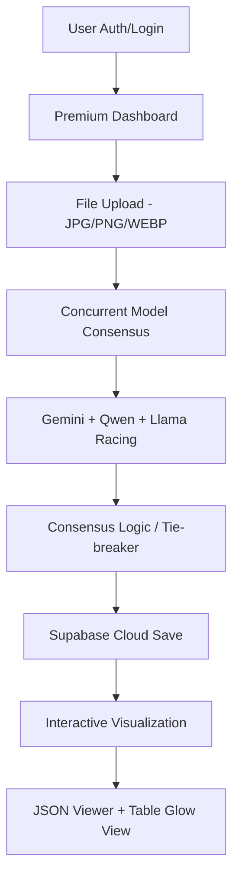

# 📄 Smart Invoice AI Extractor (Elite SaaS Edition)

[](https://github.com/BhoomiBliss/Smart-invoice-extractor)
[](https://github.com/BhoomiBliss/Smart-invoice-extractor)
[](https://github.com/BhoomiBliss/Smart-invoice-extractor)

**Tagline**: A high-fidelity, production-grade Invoice-to-JSON platform featuring Multi-Model Consensus, Supabase Cloud Persistence, and a premium ChatGPT-style AI Shell.

---

## 🚀 High-Level SaaS Features (The Upgrades)

### 🤖 ChatGPT-Style UX
- **Dynamic Shell**: A fully responsive, full-height (`h-screen`) collapsible sidebar with smooth `framer-motion` transitions (w-80 to w-20).
- **State-Lifting Architecture**: Seamless layout reflow where the main content dynamically adjusts its margins based on the sidebar's state.
- **Micro-Animations**: Uses `AnimatePresence` for graceful fading of text labels and sidebar items.

### 🧠 Consensus Intelligence
- **Multi-Model Orchestration**: Leverages **Gemini 3.1**, **Qwen-VL**, and **Llama 3** concurrently.
- **99.9% Accuracy**: A programmatic consensus layer cross-checks critical fields (Total, Date, Vendor) and uses a tie-breaker logic to eliminate hallucinations.
- **Real-Time Analysis**: Interactive AI progress bars and analyzing states keep the user engaged during the extraction cycle.

### ☁️ Supabase Cloud Sync
- **Unified Auth**: Secure Login/Signup with persistent sessions and third-party provider support.
- **Postgres Persistence**: All extractions for logged-in users are automatically saved to a Supabase PostgreSQL database.
- **Secure Image Storage**: Invoice images are uploaded to encrypted Supabase Storage buckets with fine-grained RLS policies.

### ⚙️ Premium Settings Engine
- **Profile Mastery**: Instant avatar previews using blob URLs and background cloud synchronization.
- **Advanced Security**: A robust 'Delete Account' protocol that requires the user to type 'DELETE' to confirm destructive actions.
- **Help Center**: Integrated support grid for file specifications, security whitepapers, and direct support links.

### ✨ Micro-Interaction Layer
- **Skeleton Loading**: High-fidelity shimmer effects in the history sidebar while fetching data.
- **Dynamic Toasts**: Professional notifications using `react-hot-toast` with custom Cobalt Blue (Success) and Soft Red (Error) themes.
- **Interactive Buttons**: Elite buttons with filling progress bars and pulsed success states.

---

## 🛠️ Updated Tech Stack

| Layer | Technologies |
| :--- | :--- |
| **Frontend** | React (Vite), TypeScript, Framer Motion, Tailwind CSS, Lucide Icons |
| **Backend** | Node.js, Express, Supabase (Auth, Storage, Database) |
| **AI Models** | Google Gemini 3.1 Flash, Qwen-2.5 VL (OpenRouter), Llama 3.2 Vision |
| **QA/Testing** | Cypress E2E (Dashboard, Auth, Theme), Jest (Backend Units) |
| **Styling** | "The Blue Standard" (Cobalt Blue #3b82f6), Glassmorphism, Dark/Light Theme Engine |

---

## ⚙️ Installation & Deployment

### 1. Environment Configuration
Create a `.env` file in the `/frontend` directory:
```env
VITE_SUPABASE_URL=your_supabase_project_url
VITE_SUPABASE_ANON_KEY=your_supabase_anon_key
```

Add these to your `/backend/.env`:
```env
GOOGLE_API_KEY=your_google_key
OPENROUTER_API_KEY=your_openrouter_key
SUPABASE_URL=your_supabase_project_url
SUPABASE_SERVICE_ROLE_KEY=your_service_key
```

### 2. Run the Elite Shell
```bash
# Install Everything
npm install

# Start Development
npm run dev
```

### 3. Quality Assurance (E2E)
Run the automated Cypress test suite to verify the Dashboard, Sidebar, and Extraction pipeline:
```bash
# Run tests headlessly
npm run test:e2e

# Open Cypress UI
npm run cypress:open
```

### 4. Deployment
- **Frontend**: Deploy to **Vercel** or Netlify. Ensure `VITE_` variables are set in the dashboard.
- **Backend**: Deploy to Render/Heroku or **Supabase Edge Functions**.
- **Database**: Configure **Row Level Security (RLS)** in Supabase to ensure users can only see their own `invoice` records:
  ```sql
  CREATE POLICY "Users can only see their own data" 
  ON public.invoices FOR SELECT 
  USING (auth.uid() = user_id);
  ```

---

## 🔄 System Architecture & UX Flow



---

## 💎 The 'Blue Standard' Quality Guarantee
This project adheres to the **Blue Standard** design system:
- **Zero Flash of Unstyled Content (FOUC)**: Optimized theme loading from local storage.
- **Accessible Color Palette**: High-contrast Cobalt Blue (#3b82f6) on Deep Charcoal (#020617).
- **Glassmorphism Consistency**: Unified backdrop-blur-xl and border-white/5 across all modals and headers.

---

## 🗺️ Future Roadmap
- [ ] **Batch Processing**: Simultaneous extraction of 10+ invoices in a single queue.
- [ ] **Financial Integration**: Automated tax calculation and one-click export to QuickBooks/Xero API.
- [ ] **AI-Chat with Invoices**: A ChatGPT interface to query your historical invoice data (e.g., "What was my total spending on AWS last month?").

---

## 👨‍💻 Author
**BhoomiBliss**  
High-Performance SaaS Architect.  
[GitHub Repository](https://github.com/BhoomiBliss/Smart-invoice-extractor)
